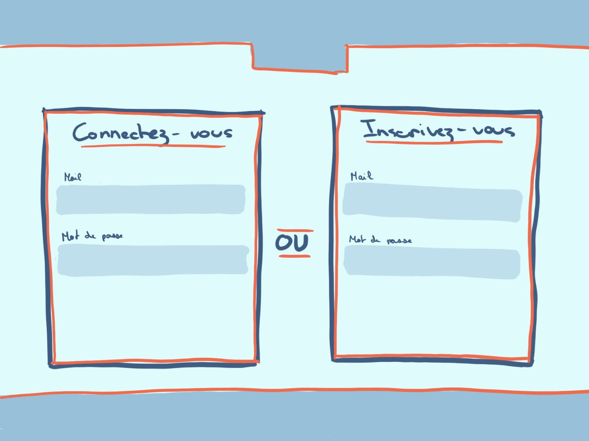

# Mini-Tripadvisor

## Getting Started

### Dependencies

* Need composer, PHP and MySQL. 

### Installing

* Git clone or download the repositery.

* Install vendor  
            ```
            composer update
            ```

* Create a MySQL database

* Copy and rename .env.exmple  
        ```
        cp .env.example .env
        ```

* Configure the .env with the databse created

* Run migration  
        ```
        php artisan migrate
        ```

* If needed you have a dump file exist to fill your database\*  
        ```
        minitripadvisor.sql
        ```

* Launch localy the laravel server
        ```
        php artisan serve
        ```

\*All users have the same password : ``password``  
Users :  
``MaisonFutari``  
``fabio``  
``Eleazar``  
``marceline``  
``Julia``  
While writing this part I see a bug where my request are case sensitive. And unfortunately I have no time left to refix it.

### Website Navigation

To create an account or sign-in press the "Register or Sign-in" button and to logout press the "Logout" button.  
In order to add aplace, you must login and press the "+" button. To delete a place you have added, click on the place and then on the trash icon. You can only delete places that you have added.  
To add a comment and/or a rating to a place, click on the place in question, select the grade and/or write your comment in the space provided on the product page. To delete your review, press the bin icon next to your review. You can only delete reviews that you have written yourself. You can only give a grade if you want.  
Click on the logo to go back home. 

## Improvment if I had Time

I know I could added a edit button on reviews and place with the back-end obviously.  
Make that a user can write only one review and add in database place an input file for pictures.
I would make more error message and css improvment.  
Disable case sensitive for login.  
Make average grade for places.  
My code is a lot messy, I didn't had time to comment it.  
Next time I will comment while i'm writing to save time.
Also, make a more obvious home button with the home.svg.

## Description

You have the Mysql Workbench Model ``schema-table.mwb``.
  
  
Wireframe for website.  




## Authors

I tried to make a custom authentification method instead of the laravel Auth just to challenge me.

Fabio Machado   [Linkedin](https://www.linkedin.com/in/fabio-aires-machado/)

## Version History

* 0.1
    * Initial Release

## License

[](https://creativecommons.org/licenses/by-nc-sa/4.0/)  

